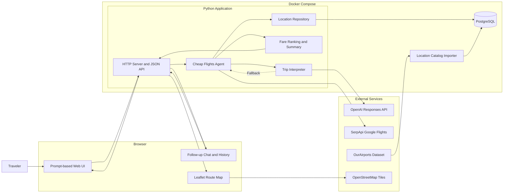

# High-Level Architecture

## Main Flow

1. The traveler describes a trip in the browser.
2. The Python API interprets the request with OpenAI Structured Outputs, with a local parser fallback.
3. Locations are validated and resolved through PostgreSQL.
4. SerpApi provides flexible-date and exact Google Flights results.
5. The agent enforces constraints, ranks fares, and produces a natural-language recommendation.
6. The browser displays the recommendation, ranked flights, and interactive route map.
7. Follow-up questions can compare existing results or trigger a refined fare search.

## Deployment Units

- `app`: Python web application and static UI.
- `postgres`: Persistent airport and location catalog.
- `locations`: One-time OurAirports import job.
- Browser storage: Saves recent conversations and result history locally.

